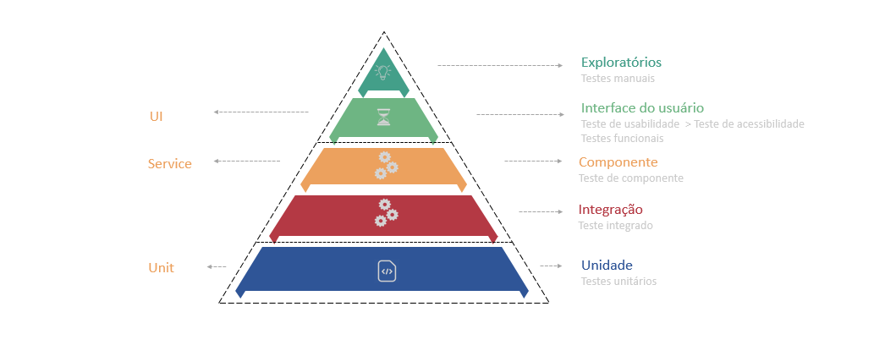

# Testes Automatizados com JUnit e Mockito

## Visão Geral
Este projeto é uma aplicação Spring Boot que exemplifica a criação de uma API para o cálculo das raízes da equação de Bhaskara, bem como outros cálculos básicos, incluindo soma, subtração, multiplicação e divisão. O objetivo principal é demonstrar a importância e a implementação de testes unitários e de integração para garantir a robustez e a confiabilidade da aplicação.

## Tecnologias Utilizadas
- Java 21
- JUnit 5.10
- Mockito 5.7

## Importância dos Testes Automatizados
Os testes automatizados desempenham um papel crucial no desenvolvimento de software de alta qualidade. Eles ajudam a garantir que o código funcione conforme o esperado e facilitam a identificação de regressões e bugs em fases iniciais do desenvolvimento. Existem dois tipos principais de testes implementados neste projeto:

### Testes Unitários:
- Focam em testar componentes individuais do sistema isoladamente.
- Verificam a lógica de negócios de métodos específicos dentro das classes.
- Utilizam mocks para simular as dependências e garantir que apenas a unidade de código em teste seja verificada.

### Testes de Integração:
- Focam em testar a interação entre múltiplos componentes do sistema.
- Verificam se os componentes do sistema funcionam corretamente juntos.
- Utilizam um contexto de aplicação completo para garantir que as dependências reais estão sendo utilizadas, em vez de mocks.

